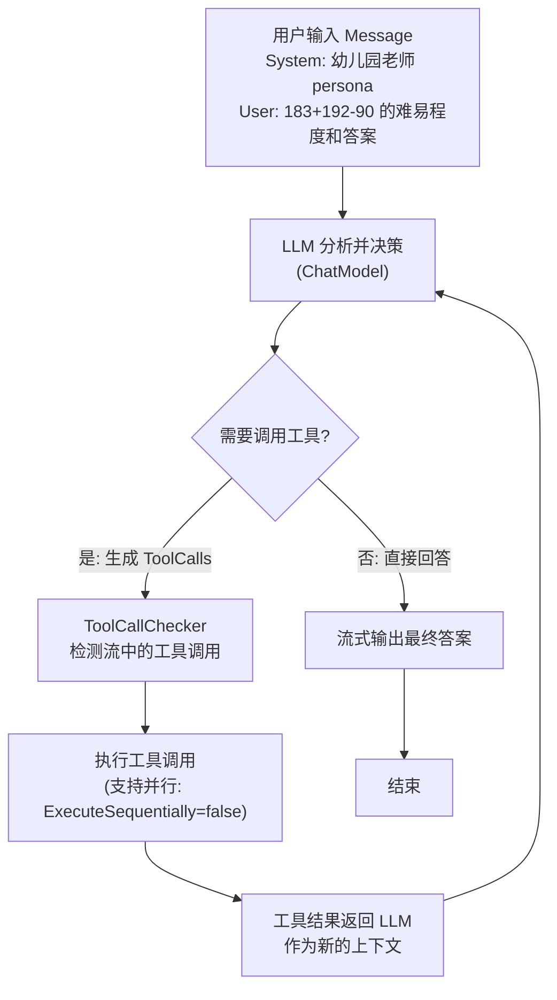
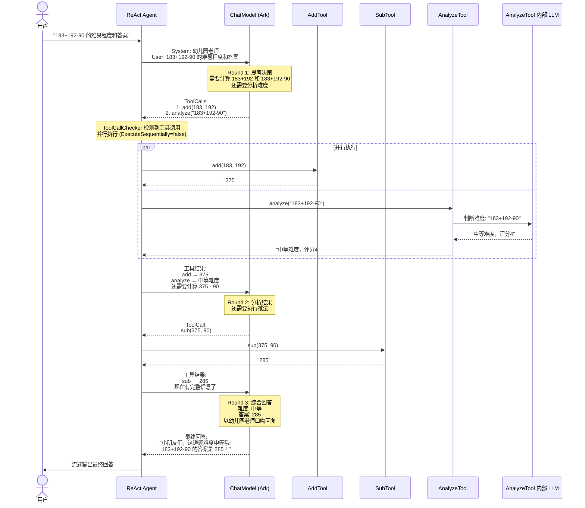

# ReAct Agent 执行逻辑

## 一、核心架构

```
┌─────────────────────────────────────────────────────────┐
│                    ReAct Agent                          │
│                                                         │
│   ┌──────────┐    ┌──────────┐    ┌──────────────────┐ │
│   │   LLM    │◄──►│  Tools   │    │  ToolCallChecker │ │
│   │ (ChatModel)│   │ (Add/Sub │    │  (流式工具检测)   │ │
│   │          │    │  /Analyze)│    └──────────────────┘ │
│   └──────────┘    └──────────┘                          │
│        │               │                                 │
│        ▼               ▼                                 │
│   ┌─────────────────────────────────────────────────┐   │
│   │              ReAct Loop (思考→行动→观察)          │   │
│   └─────────────────────────────────────────────────┘   │
└─────────────────────────────────────────────────────────┘
```

## 二、ReAct 循环流程



## 三、本例具体执行时序



## 四、关键组件说明

### 4.1 Agent 配置

| 配置项 | 值 | 说明 |
|--------|-----|------|
| `ToolCallingModel` | Ark ChatModel | 驱动 ReAct 循环的 LLM |
| `Tools` | AddTool, SubTool, AnalyzeTool | 可供调用的工具集 |
| `ExecuteSequentially` | `false` | 工具并行执行 |
| `StreamToolCallChecker` | 自定义函数 | 从流中检测是否有工具调用 |

### 4.2 三个工具

| 工具 | 功能 | 输入 | 输出 |
|------|------|------|------|
| AddTool | 加法 | `{a: int, b: int}` | 和 (string) |
| SubTool | 减法 | `{a: int, b: int}` | 差 (string) |
| AnalyzeTool | 难度评估 | `{content: string}` | 难度描述 (调用内部 LLM) |

### 4.3 ToolCallChecker

```
流式读取 LLM 输出 → 逐条检查 msg.ToolCalls → 有则返回 true → 无则继续读 → EOF 返回 false
```

作用：在流式场景下提前判断 LLM 是打算调用工具还是直接回答，避免 Agent 等待完整输出后才做决策。

### 4.4 LoggerCallback

通过 `callbacks` 机制注入，监控 Agent 执行过程：
- **OnStart**: 打印节点输入
- **OnEnd**: 打印节点输出
- **OnEndWithStreamOutput**: 打印 Graph 层级的流式输出
- **OnError**: 打印错误信息

## 五、数据流总结

```
User Input ([]*schema.Message)
    │
    ▼
┌──────────────────────────────────────┐
│         ReAct Agent (Graph)          │
│                                      │
│  ┌────┐   ToolCall?   ┌────────┐   │
│  │LLM │──────────────►│ Tools  │   │
│  │    │◄──────────────│ Node   │   │
│  └────┘   ToolResult  └────────┘   │
│     │                               │
│     │ No ToolCall (直接回答)          │
│     ▼                               │
│  Final Answer                       │
└──────────────────────────────────────┘
    │
    ▼
Stream Output (*schema.StreamReader[*schema.Message])
    │
    ▼
Final Content: "小朋友们，这道题是中等难度，答案是 285 哦~"
```
